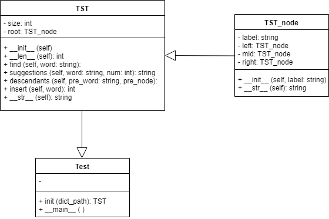
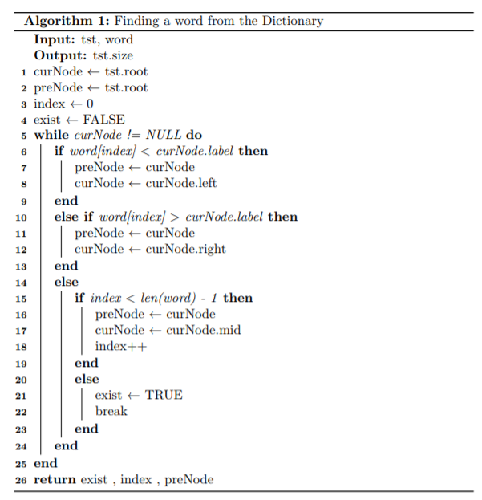
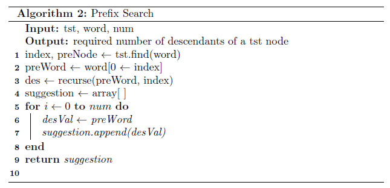

# Auto-correction
Auto-correction is implemented with ternary search tree and hashing in this project.

## Deisgn
### TST Class Diagram

### Lookup Algorithm

### Search Algorithm

### Insert Algorithm

