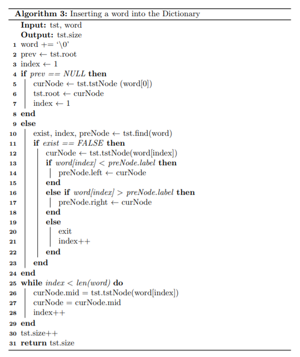

# Auto-correction
Auto-correction is implemented with ternary search tree and hashing in this project.

## Deisgn
### Data Structure and Algorithms
* Ternary Search Tree
* Hashing
### TST Class Diagram

## Algorithms
### Lookup Algorithm

### Search Algorithm

### Insert Algorithm

